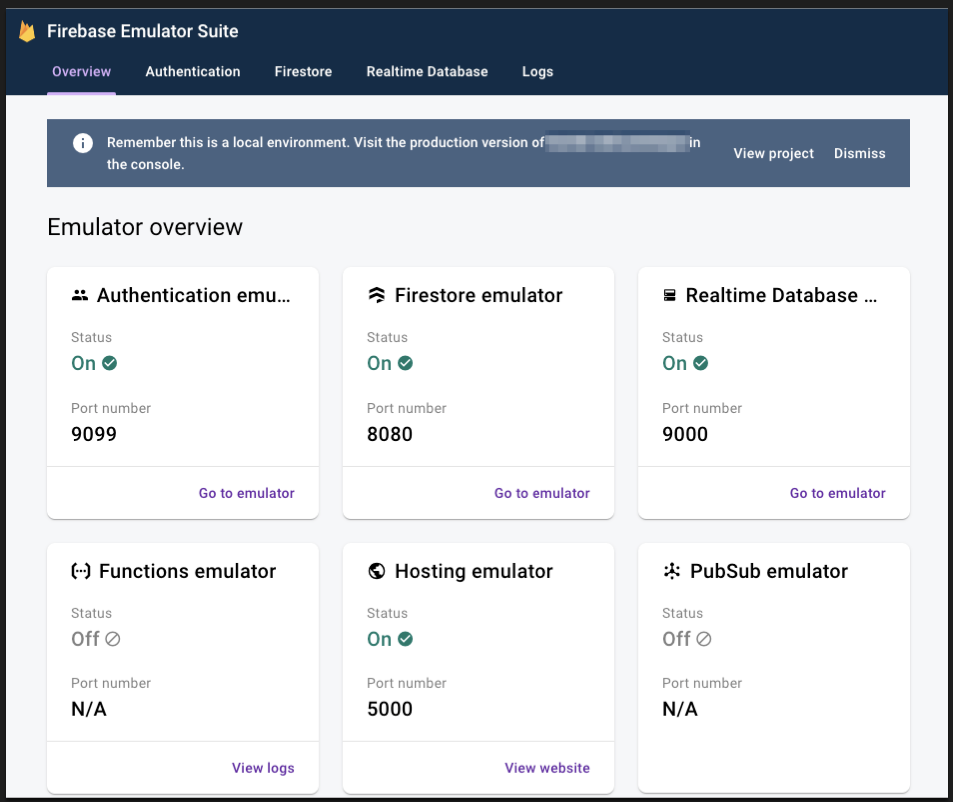

+++
title = "Firebase Emulator を使ってローカル開発を捗らせる。"
date = 2020-12-07T20:00:00+09:00
tags = ["Firebase"]
draft = false
toc = false
backtotop = false
disable_comments = true
+++

## 前提

```json
- firebase のプロジェクトの初期化が終わっていること
- firebase 8.1.2 以降
- firebase-tools 7.8.0 以降
- Java 1.8 以降
- node 8.0 以降
```

## Local Emulator Suite を構成する

- `firebase init emulators`

以下のように firebase.json に emulator に関する設定が追加される

```json
"emulators": {
    "firestore": {
      "port": "8080"
    },
    "ui": {
      "enabled": true,      // Default is `true`
      "host": "localhost",
      "port": 4000          // If unspecified, see CLI log for selected port
    },
    "auth": {
      "port": "9099"
    },
    "functions": {
      "port": "5001"
    },
    "database": {
      "port": "9000"
    },
    "pubsub": {
      "port": "8085"
    }
  }
```

- 生成された port を みに行くように firebase を initialize しているところなどで記述を追加する

```tsx
import firebase from 'firebase';

// 使うサービスによってここのパラメータはいらないものもあります。
const config = {
  apiKey: 'YOUR_API_KEY',
  authDomain: 'YOUR_AUTH_DOMAIN',
  databaseURL: 'YOUR_DATABASE_URL',
  projectId: 'YOUR_PROJECT_ID',
  storageBucket: 'YOUR_STORAGE_BUCKET',
  messagingSenderId: 'YOUR_MESSAGING_SENDER_ID',
  appId: 'YOUR_APP_ID',
  measurementId: 'YOUR_MEASUREMENT_ID'
};

const app = firebase.initializeApp(config);

export const auth = app.auth();
export const db = app.database();
export const store = app.firestore();

/*
 * ここで簡単に環境を切り替えるようにしていますが、
 * 起動時に環境変数を用いて切り替える方でもいいです。
 */ 
const isEmulating = window.location.hostname === 'localhost';

if (isEmulating) {
  console.log('Firestore using local emulator');
  // fire store の host の向き先、ここは設定した port を指定してください
  store.settings({
    host: 'localhost:8080',
    ssl: false
  });
  // realtime database の向き先、ここは設定した port を指定してください
  db.useEmulator('localhost', 9000);
  // authentication  の向き先、ここは設定した port を指定してください
  auth.useEmulator('http://localhost:9099/');
}
```

整理したデフォルト port 一覧はこちら

```tsx
| 9099 | firebase Auth |
| 8080 | firestore |
| 9000 | database |
| 5000 | hosting |
| 8081 | firebase ui |
```

## 起動する

`firebase emulators:start`

自分の場合は npm script にこんな感じで追加してます。

`"firebase-local": "firebase emulators:start"`

すると [`http://localhost:8081/`](http://localhost:8081/) でローカルの firebase が立ち上がります



あとは、いつも通り開発するだけです。

これのおかげで本番データを気にせず、ローカル開発ができるようになりました。👏

### 参考

- [https://firebase.google.com/docs/emulator-suite](https://firebase.google.com/docs/emulator-suite)
- [https://firebase.google.com/docs/emulator-suite/install_and_configure](https://firebase.google.com/docs/emulator-suite/install_and_configure)
- [https://gist.github.com/jaytaylor/b14716671ae6a8cd057bd6d849670238](https://gist.github.com/jaytaylor/b14716671ae6a8cd057bd6d849670238)
