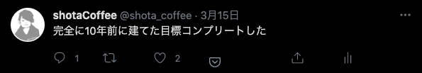

+++
title = "2021年3月の振り返り"
date = 2021-03-22T20:00:00+09:00
tags = ["棚卸し"]
draft = false
toc = false
backtotop = false
disable_comments = true
+++
# 2021年3月の振り返り

## 10年前の目標をコンプリートした

18歳くらいの時にたてた目標を無事にハイ達成しました。

内容は働き方や、生活に関することですが、もうだめかなぁと思ってたところ、色々あって達成できました 🙌

## めちゃくちゃコード書いた

短期間で割と猛烈に書き上げました。

- AWS Cognito（便利風だけどなんだかんだ癖あった、Amplifyの中身読んで解読した
- Stripe（色々パターン多くてドキュメントがむずい、お金って大変）
- GitHub Actions（便利、便利。

あたりに詳しくなった気がする。

`この解析結果を出してるのは [cloc](https://github.com/AlDanial/cloc) というものです。`

そろそろマイクロフロントエンドとかBFFをちゃんとやりたいなという気持ちが芽生えてきた。

## チームを作る動きになりつつある

主にフロントエンドの改善を行うチームを組成できることになった。

地道にコツコツと改善を行い約3ヶ月ほど、

コンパイルの時間を減らしたり、いろんなアップデートを行ったり。

主な成果はコンパイル速度を 1/3 にできたことや、カオスなwebpackをきれいにして色々やったとか、lint を整えるだとか、そういう根底の部分にも力を注ぎ始めた。

最初は一人だったが、メンバーが増えて高速で改善が進み始めているので、

**asIs と tobe と 課題を揃えて説明を果たし、ビシネスに寄り添いながら、グロースを止めない基盤づくりをしていきたい。**

### チームの中で活発にLT的なことをし始めた

チームの勉強会の一環で隔週で勉強会が始まったので話せそうなことをドキュメント書いて発表している

- 速習 CSS レイアウト
- ちゃんと覚える Table タグ
- 緩く始める 型付け
- zsh で設定してる便利 alias
- 書いて覚える React

こんな内容を書いたり話したりしてる。

## フロントの基盤改善に関わる本を買ったり、イベント行ったり

- [UIT meetup vol.12『リニューアル戦略発表会(一部から全部まで)』](https://uit.connpass.com/event/201312/)
- [MixLeap Live Study #64 - フロントエンドのテスト効率化](https://yahoo-osaka.connpass.com/event/201930/)
- WEB+DB PRESS Vol.119　特集フロントエンド脱レガシー｜障害対応演習｜深層学習入門以前
- WEB+DB PRESS Vol.117 実戦投入 TypeScript

etc...

めちゃくちゃ役立った。どれも即戦力すぎた。

## 最後に

しっかり今月までは2をやれてる感じ、3も予定を組んで実行し始めた。1がやばい。

今日も肩凝りすぎて、首が動かない。運動していきたい。

終わり
