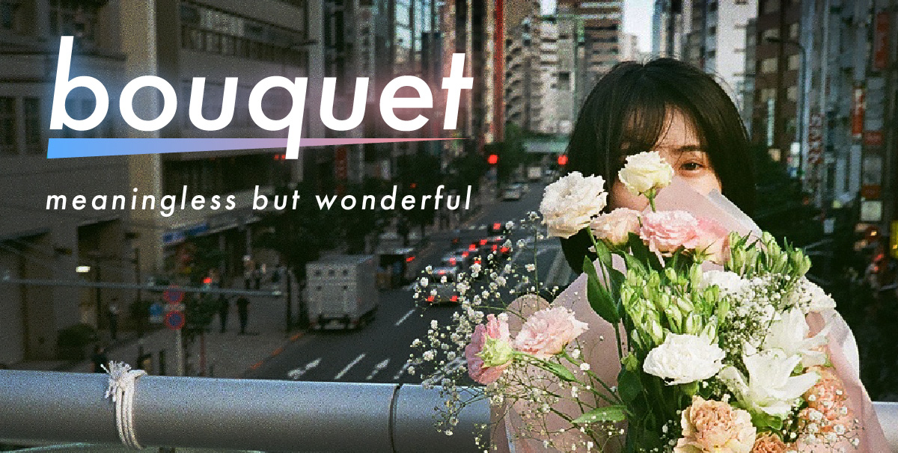

## スプラが初エリア S+ になった
X なお兄さん方に囲まれながらリグマで鍛えられた。  
初めてパワー2000超えの試合にも勝った。  
ブキは黒 ZAP をメインに、ステージによってプライムを持ってます。  
たまに遊びで筆持ってるけど、筆も楽しい。

## フロントエンド周りの技術移行開始
リプレイスプロジェクトが動き始めた。  
メンバーと一緒にアーキテクチャを考えたり、Lint/Format を始めとした社内用の小さいライブラリを構築したり。  
作ったあと [この記事](https://zenn.dev/yoshiko/articles/0994f518015c04) が出て、改善したい気持ちが高まってたり。  
半ばでメンバーが増えてオンボーディング戦略考えたり、ペアプロしたり。
目下テスト周りを手を動かしながら考えたり。ドキュメント整えたり、
画面単位機能単位と、リリースしています。（またこれは別で何か書くかもしれない）

## サービスを1つリリースしました

[bouquet](https://www.bouquet-music.net/) という音楽ニュースレターアプリをリリースしました。  
バックエンドの方がお手伝いとしてきてくださり。みんなで草ベンチャー状態ですが、「音楽」をテーマに試していけたらなと思ってます。
技術的なところはこんな感じで実現しています。

```
- React
- AWS Amplify
  - cognito
  - AppSync
  - Dynamo
  - lambda
- Stripe
- SendGrid  
```

とてもシンプルになるべく薄く書いてます。  
初めてプロダクションコードに GraphQL を使ってみたかもしれない。  
楽しかったのでここは他のことでも使っていきたい。

開発周りの話は、コンポーネント駆動開発しつつ（割としっかり Storybook 書いたり）、インフラ周りは全て Amplify に。  
また、やってく中で「この Hooks また書いてるな」ってのが増えてきたので、少しずつ OSS として切り出しちゃおうということで、
[npm パッケージ](https://www.npmjs.com/package/@shotacoffee/utilhooks) として公開しました。  
リポジトリは [こちら](https://github.com/shotaCoffee/util-hooks) issue 投げていただいたり、
  これよく使うんだよねっていうのがあれば PR 投げていただければと思います（まだそこら辺何も整えてないですが）

## 今年の目標について



### 健康 &#x2614;
ほんと何もできてないし、むしろ寝つき悪くなってよくない。  
基本 30 分おきに立って仕事するようにしてるものの、運動が足りてない感じ。要改善

### 技術の深さと広さの両立 &#x26c5;
新しいものに触れられてないので、残りの時間で普段触らないものに触れていきたいところ、 JVM 系と何かは触りたい。  
深さはチームメイトとともに、海外記事を漁りつつ手を動かしながら考えたり、個人開発であれこれと試したりできてるのでOK

### 投資 &#x2600;
年始から初めてコツコツと、ポイント運用なども合わせると割といい感じになってきた。  
技術と同じように小さく初めて振り返りつつ何をやるとどうなるのか。  
どう対策しておくといいのか、みたいなのをコツコツ積み重ねれている感じ。  
この点に関しては、個人的な興味も前々からあったのもあって楽しい。
