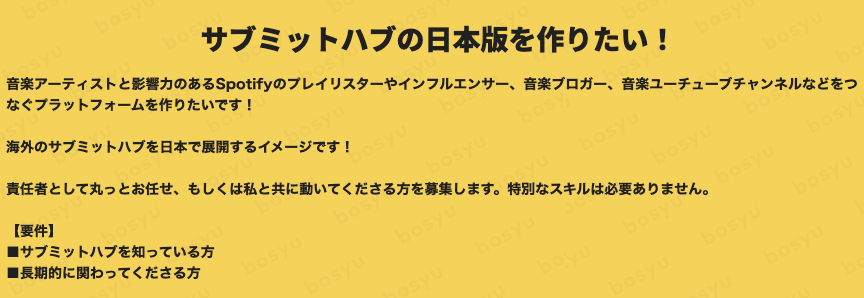

リリースしてひと段落ついてきたので、記録用に。

## 音楽アーティストとキュレーターを繋ぐプラットフォーム「hurrah（フラー）」β版をリリースしました

[https://www.hurrah-music.com/](https://www.hurrah-music.com/)

本日 18:00 こちらのサービスを公開しました。

## きっかけ

去年の5月に Twitter で bosyu を見かけて気になったのでメッセージを飛ばしてみたことがきっかけでした。

bosyu すごい。このあとデザイナーだったり、メンバーが増えて4人でリリースまで漕ぎ着きました。

## どんなサービスなの？

hurrah はアーティストが楽曲をサービス内に投稿し、キュレーターへメッセージを行いプロモーションしてもらう。

またはキュレータが気になる楽曲をピックアップしてプロモーションすることができます。

ここら辺の詳細はLPだったり後日公開される記事だったりを読んでいただければと思ってます。

[https://www.hurrah-music.com/](https://www.hurrah-music.com/)

## 最後に

RTしてくださった皆様登録してくれたユーザーの方々ありがとうございます。

これからも引き続き hurrah をよろしくお願いいたします。

どんどん改善して使いやすい音楽プラットフォームにしていけたらと思うので、インタビューなど協力いただけると幸いです。
